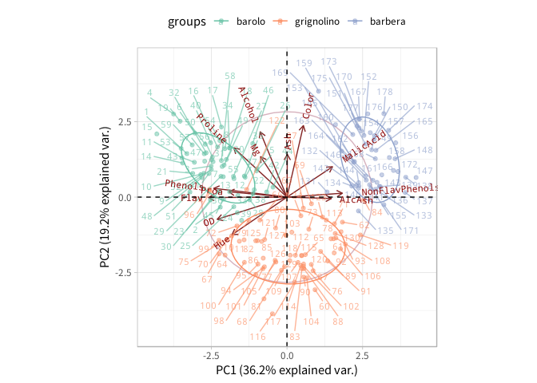

<!-- README.md is generated from README.Rmd. Please edit that file -->
**ATTENTION**  
パッケージをpre-releaseしました。以下のコマンドでインストールできます。  
> devtools::install_github("k-metrics/ggbiplot")

**ABOUT**  
本リポジトリは3年以上開発が行われていない [vqv/ggbiplot v0.55](https://github.com/vqv/ggbiplot) リポジトリをフォークし [nyubachi/ggbiplot](https://github.com/nyubachi/ggbiplot) リポジトリでの修正を参考にしています。

主な変更点
==========

v0.55.1 - update ggbiplot.r
--------------------

-   日本語フォントを指定てきるように以下のパラメータを追加
    -   `base_family` - ggplot2のテーマに対するフォント指定
    -   `family` - 変数名やラベル名などのテキスト描画関数に対するフォント指定
-   ラベルを表示しない場合にIDを表示できるように以下のパラメータを追加
    -   `id` - プロットする（`TRUE`）/しない（`FALSE`, デフォルト）
-   ラベル表示に`ggreple`パッケージを用いることでラベルが重なることを防止
-   ラベルまたはIDとポイント（点）が同時に表示できるように変更
-   アルファチャネル（`alpha`）の指定がラベルまたはIDにも反映するように変更
-   `ggscreeplot`関数は未変更です

> データの変数名に日本語が含まれているとmacOS環境で豆腐文字になってしまうのを回避するためにフォント指定のパラメータを追加してあります。macOS環境で日本語の変数名やラベルを表示する場合、少なくとも`family`パラメータにフォント名を指定してください。

ggbiplot
========

An implementation of the biplot using ggplot2. The package provides two functions: `ggscreeplot()` and `ggbiplot()`. `ggbiplot` aims to be a drop-in replacement for the built-in R function `biplot.princomp()` with extended functionality for labeling groups, drawing a correlation circle, and adding Normal probability ellipsoids.

*The development of this software was supported in part by NSF Postdoctoral Fellowship DMS-0903120*

Installation
------------

``` r
library(devtools)
install_github("k-metrics/ggbiplot")
```

Example Usage
-------------

``` r
library(ggbiplot)
data(wine)
windowsFonts(`Noto Mono` = windowsFont("Noto Mono")   # Windows ONLY
```

``` r
wine %>% 
  prcomp(scale. = TRUE) %>% 
  ggbiplot(obs.scale = 1, var.scale = 1, ellipse = TRUE, alpha = 0.5,
           circle = TRUE, groups = wine.class,
           id = TRUE, family = "Noto Mono") +
    theme_light() + 
    xlim(c(-4.5, 4.5)) + ylim(c(-4.5, 4.5)) + 
    geom_hline(yintercept = 0, linetype = "dashed") + 
    geom_vline(xintercept = 0, linetype = "dashed") + 
    scale_color_brewer(palette = "Set2") + 
    theme(legend.direction = 'horizontal', legend.position = 'top')
```


